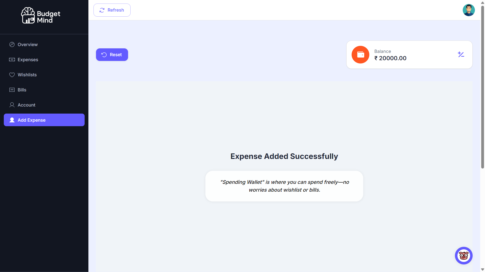

# BudgetMind

# 💰 BudgetMind - Smart Personal Finance Manager

BudgetMind is an **intelligent personal finance management system** that combines **automation** with **user flexibility**. It helps users manage their salary, budgets, bills, and wishlist items in a way that guarantees financial stability while offering full manual control.

---

## 🚀 Features

### 🎯 Salary & Wallet Management
- Automatically distributes salary across multiple wallets:
  - **Secure Saving (Main Wallet):** Long-term savings.
  - **Spending Wallet (Temporary):** Day-to-day expenses.
  - **Wishlist Saving:** Funds allocated for wishlist items.
  - **Bill Saving (Fixed Wallet):** Reserved for monthly bills.
- Dynamically adjusts daily budget based on user’s salary cycle.

### 🛒 Wishlist
- Add products with cost, priority, and purchase timeline.
- Gradual saving based on months left and priority.
- Allows buying wishlist items even if unfunded, using fallback options.
- Avoids deducting from the same product while processing purchases.

### 🧾 Bill Management
- Permanent bills (recurring monthly) and non-permanent bills (e.g., EMI for limited months).
- On salary day, the system automatically checks if each bill is already funded and paid; if not, it will not re-fund the bill.
- Allows bills to be paid even if unfunded, using fallback wallet options.
- Prevents deducting from the same bill during fallback payments.

### 📊 Gozometer: Dynamic Risk Meter

The Gozometer is a smart financial assistant that guides users on whether their planned expense is safe, slightly risky, or impossible based on their wallets and budgets. It works dynamically and adjusts according to the user’s current financial state.

---

#### 🏷️ Risk Levels & Messages

| Level                | Description                                                                                         |
|-----------------------|-----------------------------------------------------------------------------------------------------|
| **Neutral**           | Enter a value to check your spending.                                                              |
| ✅ **Good**           | Great! Your budget is enough to cover this expense.                                                |
| ⚠️ **Slightly Over**  | Your expense slightly exceeds your budget. It can be managed using leftover funds or past savings. |
| 💸 **Spending Wallet**| Budget isn’t enough. This amount will be taken from your Spending Wallet. Spend wisely.            |
| 🏦 **Main Wallet Access**| Expense exceeds the Spending Wallet. Funds will be deducted from your **Secure Savings** or **Wishlist Savings** (as per user choice). The system also allows reducing the monthly budget (if permitted by the user). |
| 🔥 **High Risk Zone**   | Maximum amount accessible. Includes all wallets and savings. Spending here is risky and could disrupt wishlist timelines or unpaid bills. Proceed with caution. |
| 🚫 **Impossible**      | Expense is too high to proceed. Adjust available funds or budgets if you still wish to spend.      |

---

#### 🔄 **How It Works**
1. **Daily Budget First** – Checks if the expense fits within today’s budget.  
2. **Buffer Wallet** – Uses leftover funds from previous days if needed.  
3. **Spending Wallet** – Pulls from your general expenses wallet when over budget.  
4. **Main Wallet Access** – If expense exceeds the Spending Wallet, it uses **Secure Savings** or **Wishlist Savings**. The system also allows reducing the monthly budget (with user consent).  
5. **High Risk Zone** – This is the **maximum amount the user can access**, including all wallets and savings. It warns about potential financial instability.  
6. **Impossible** – Blocks expense if it exceeds all limits.  

✅ **Dynamic Advice**: For each level, the Gozometer shows clear tips like:  
- *"Spend cautiously."*  
- *"Adjust your budget for better control."*  
- *"Update available funds or reduce wishlist priority to proceed."*

---

### ⚙️ Advanced Logic
- Secure Saving thresholds ensure critical savings aren’t accidentally drained.
- Midnight jobs for:
  - Distributing salary
  - Refilling Secure Saving

### 🛒 Priority-based Wishlist Management

BudgetMind introduces **smart priority handling** for wishlist items to ensure important goals are always on track.

✅ **Distribution (Adding Money):**
- Higher priority items receive funds first.
- This guarantees **top-priority products** can be purchased within the user’s target month.

✅ **Gradual Deduction (Taking Money Out):**
- When the user requests extra funds from wishlist savings:
  - Low-priority items are used first.
  - But funds are **deducted gradually across multiple items** to avoid draining any single item too quickly.
  - Timeline (months left) is adjusted for each item as funds are deducted.

---

## 📸 Screenshots

### 📝 Sign Up

### 🔑 Sign In

### 📊 Dashboard Overview

### 💵 Expenses Tracking

### 🛍️ Wishlist Management

### 🧾 Bills Management

### 👤 Account Settings

### ➕ Add Expense (Before Filling)

### ✅ Add Expense (After Filling)

---

## 🛠️ Tech Stack

**Frontend:**
- Next.js (React framework for server-rendered apps)
- React.js with component-based architecture
- Material UI for consistent and elegant design
- Axios for API handling
- React Context API for state management

**Backend:**
- Node.js with Express.js for RESTful APIs
- MongoDB as the database (via Mongoose ORM)
- JWT for authentication & refresh token management

**Others:**
- Cloudinary for media handling
- ExcelJS for report generation (user expense download)
- NodeCache for faster user context retrieval

